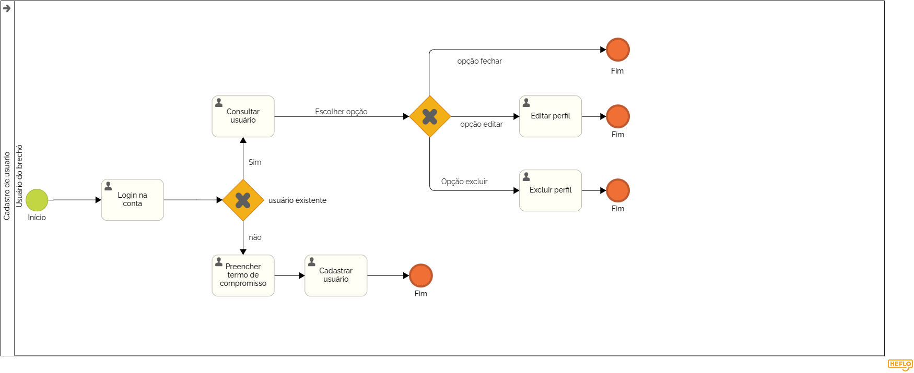

### 3.3.3 Processo 3 – Cadastro do usuário

_Cadastro de usuário, acredito que, para melhorar o processo na perspectiva do usuário, seria bom ter algumas tarefas de serviço e de usuário que ampliem a clareza e a eficiência do modelo. Por exemplo, seria útil contar com uma tarefa de serviço que envie automaticamente um e-mail de confirmação após o cadastro, garantindo que o usuário saiba que sua solicitação foi concluída. Também seria interessante inserir uma etapa de validação dos dados antes do preenchimento do termo de compra, de forma a prevenir erros e evitar retrabalhos. Além disso, poderia haver uma tarefa de feedback ao final, permitindo ao usuário avaliar sua experiência e fornecer informações valiosas para futuras melhorias. Por fim, seria recomendável incluir um subprocesso de suporte que, quando necessário, encaminhe o usuário diretamente a uma equipe especializada, assegurando um atendimento rápido e eficiente em eventuais dúvidas ou problemas.

padrão BPMN._ :
 
 

#### Detalhamento das atividades

O processo começa com Consultar cliente (tarefa do tipo Usuário), onde o usuário do brechó verifica se o cliente já possui cadastro. Em seguida, o Gateway Cliente existente (gateway exclusivo) define o fluxo: se o cliente não estiver cadastrado, segue para Cadastrar cliente (tarefa do tipo Usuário), onde são inseridos os dados pessoais.
Depois, o cliente deve Preencher termo de compromisso (tarefa do tipo Usuário). No Gateway Aceitação do termo (gateway exclusivo), o sistema verifica se os termos foram aceitos. Se sim, segue para Habilitar cadastro (tarefa do tipo Serviço), finalizando o processo. Caso contrário, o fluxo é encerrado.
Se o cliente já estiver cadastrado, realiza o Login na conta (tarefa do tipo Usuário) e, no Gateway Escolher opção (gateway exclusivo), escolhe entre duas ações: Editar perfil (tarefa do tipo Usuário) ou Excluir perfil (tarefa do tipo Usuário). Ambas encerram o processo após sua execução.

_Os tipos de dados a serem utilizados são:_

_* **Caixa de texto** - campo texto de uma linha, como nome completo, e-mail, nome de usuários_

 _* **Área de texto** - campo texto de múltiplas linhas_
 
_* **Número** -número de telefone ou número de documento_

_* **Data** - campo do tipo data (dd-mm-aaaa), como data de nascimento_

 _* **Data e Hora** - campo do tipo data e hora (dd-mm-aaaa, hh:mm:ss)_
 
_* **Imagem** - campo contendo uma imagem_

_* **Seleção única** - campo com várias opções de valores que são mutuamente exclusivas (tradicional radio button ou combobox)_

_* **Arquivo** - campo de upload de documento_

**consultar cliente**

| **Campo**       | **Tipo**         | **Restrições** | **Valor default** |
 | ---             | ---              | ---            | ---               |
 | e-mail| caixa de texto  |	formato de e-mail, obrigatório|                   |
 |   nome              |       caixa de texto           |                |                   |
  |   CPF          | formato CPF, obrigatorio              |            |                |

| **Comandos**         |  **Destino**                   | **Tipo** |
 | ---                  | ---                            | ---               |
 | confirmar | 	login/cadastro  | 	default|  |  

**login**

| **Campo**       | **Tipo**         | **Restrições** | **Valor default** |
 | ---             | ---              | ---            | ---               |
 | e-mail          | Caixa de Texto   |formato de e-mail, obrigatório |           |
 |  senha          |   Caixa de Texto | mínimo de 8 caracteres  |  |

| **Comandos**         |  **Destino**                   | **Tipo**          |
 | ---                  | ---                            | ---               |
 | confirmar | 	pagina inicial   | 	default|  |  
 | cadastre-se                | pagina de cadastro de usuario                           |             |
  | recuperar senha                  | pagina de recupereção de senha                            |                |

**cadastro de usuario**

| **Campo**       | **Tipo**         | **Restrições** | **Valor default** |
 | ---             | ---              | ---            | ---               |
 | nome completo   | Caixa de Texto   |    mínimo de 8 caracteres       |                |
 | e-mail          | Caixa de Texto   |formato de e-mail, obrigatório |           |
 |  senha          |   Caixa de Texto | mínimo de 8 caracteres  |  |
 |   confirmação de senha          |   Caixa de Texto | mínimo de 8 caracteres  |  |
 |CPF      | caixa de texto    | formato de CPF, obrigatório|           |
 |data de nascimento| Data            | maior de 18 anos|           |
  | aceite do termo dos termo de compromisso                  | check box                           | ---               |
  | registrar chave Pix                | Caixa de Texto                          | formato da chave Pix (opcional)        |
 | registrar cartão         | Caixa de Texto                          | campos obrigatórios para número, nome e data de expiração     |

| **Comandos**         |  **Destino**                   | **Tipo** |
 | ---                  | ---                            | ---               |
 | confirmar             | login          | default           |
 | login              | pagina de login                          |             |
 | aceite dos termos de compromiso                  | termo de compromisso                           | ---               |
 | registrar chave Pix           | 	página de Pix                         |      	botão       |
 | registrar cartão de crédito                | página de cartão                        |	botão             |
 
 
**termo de compromisso**

| **Campo**       | **Tipo**         | **Restrições** | **Valor default** |
 | ---             | ---              | ---            | ---               |
 | aceite dos termos de compromisso          | checkbox             |             |              |             

| **Comandos**         |  **Destino**                   | **Tipo** |
 | ---                  | ---                            | ---               |
 | confirmar               | cadastro de usuario        | 	default          |

**editar perfil do usuário**

| **Campo**       | **Tipo**         | **Restrições** | **Valor default** |
 | ---             | ---              | ---            | ---               |
 | nome completo   | Caixa de Texto   |    mínimo de 8 caracteres       |                |
 | e-mail          | Caixa de Texto   |formato de e-mail, obrigatório |           |
 |  senha          |   Caixa de Texto | mínimo de 8 caracteres  |  |
 |   confirmação de senha          |   Caixa de Texto | mínimo de 8 caracteres |  |
 |telefone| caixa de texto          | mínimo de 11 caracteres |           |
 |CPF      | caixa de texto    | formato de CPF, obrigatório|           |
 |data de nascimento| Data            | maior de 18 anos|           |
 |      cidade   | caixa de texto          |     |           |
 |      estado    | caixa de texto          |     |           |
 |      CEP    | caixa de texto          |formato de CEP, obrigatório |           |
 |      Endereço   | caixa de texto          | |           |
 |      número da residência    | caixa de texto          |      |           |
 |      complemento    | caixa de texto          |     |           |
 |      bairro    | caixa de texto          |     |           |

| **Comandos**         |  **Destino**                   | **Tipo** |
 | ---                  | ---                            | ---               |
 | salvar              | alteração dos dados          | default           |
 | icone de voltar                 | pagina anterior                          |               |
 

**excluir conta do cliente**

| **Campo**       | **Tipo**         | **Restrições** | **Valor default** |
 | ---             | ---              | ---            | ---               |
 | senha          | Caixa de Texto   |formato de e-mail, obrigatório |           |
 |  confirme sua senha          |   Caixa de Texto | mínimo de 8 caracteres  |  |

| **Comandos**         |  **Destino**                   | **Tipo**          |
 | ---                  | ---                            | ---               |
 | confirmar | 	remoção da conta   | 	default|  |  
  | icone de voltar                 |  pagina anterior                            | ---               |

