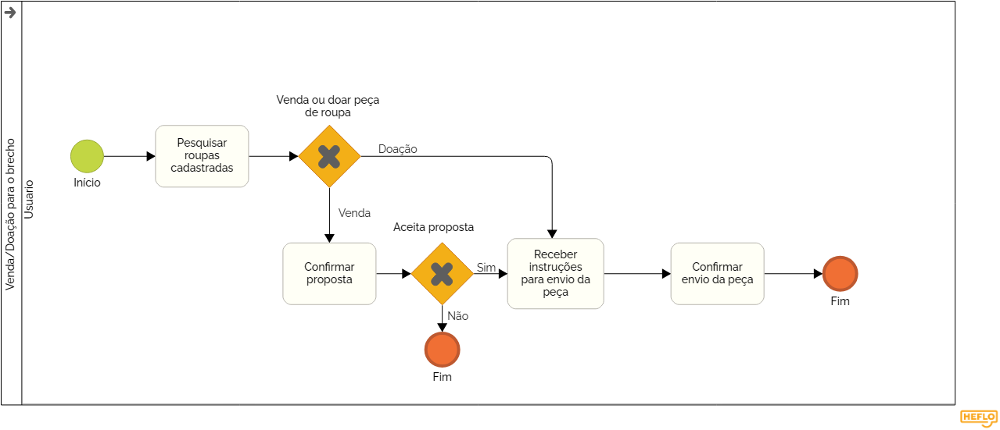

### 3.3.1 Processo 1 – Venda/Doação para brechó

Para melhorar o processo de Venda/Doação para Brechó, seria interessante implementar algumas inovações. O sistema poderia incluir notificações automáticas, mantendo o usuário informado sobre o status da peça, seja na venda ou na doação, com informações como a confirmação da proposta ou o impacto social da doação. Além disso, a integração com APIs de logística permitiria gerar etiquetas de envio e calcular o custo do frete automaticamente, simplificando o processo de envio e oferecendo a opção de agendamento de coleta, facilitando a logística. O sistema também poderia coletar feedback contínuo dos usuários, permitindo que eles avaliem sua experiência e forneçam sugestões para melhorar o serviço, o que ajudaria a personalizar a experiência e otimizar transações futuras. Por fim, um sistema de recompensas para usuários frequentes poderia ser implementado, oferecendo benefícios exclusivos, como descontos ou vantagens em futuras transações, incentivando a participação contínua e a fidelização na plataforma.

#### Detalhamento das atividades

  O processo começa com a atividade Pesquisar roupas cadastradas (tarefa do tipo Usuário), onde o usuário acessa a lista de roupas já registradas no sistema. O próximo passo ocorre no Gateway Vender ou doar peça de roupa (gateway exclusivo), onde o usuário deve decidir entre duas opções: vender ou doar a peça de roupa.
Caso a escolha seja Doar, o fluxo segue para a tarefa Receber instruções para envio da peça (tarefa do tipo Sistema), onde o sistema fornece informações sobre como realizar o envio da peça. Após isso, o usuário segue para Confirmar envio da peça (tarefa do tipo Usuário), onde ele confirma que a peça foi despachada, encerrando o fluxo.
Se a escolha for Vender, o processo segue para Confirmar proposta (tarefa do tipo Usuário), onde o usuário avalia e decide se aceita a proposta de venda recebida. Se o usuário aceitar a proposta, o fluxo continua para a tarefa Receber instruções para envio da peça (tarefa do tipo Sistema), onde são fornecidas as instruções de como enviar a peça ao comprador. O último passo é Confirmar envio da peça (tarefa do tipo Usuário), onde o usuário confirma que a peça foi enviada, finalizando o processo de venda.

_Os tipos de dados a serem utilizados são:_

_* **Área de texto** - campo texto de múltiplas linhas_

_* **Caixa de texto** - campo texto de uma linha_

_* **Número** - campo numérico_

_* **Data** - campo do tipo data (dd-mm-aaaa)_

_* **Hora** - campo do tipo hora (hh:mm:ss)_

_* **Data e Hora** - campo do tipo data e hora (dd-mm-aaaa, hh:mm:ss)_

_* **Imagem** - campo contendo uma imagem_

_* **Seleção única** - campo com várias opções de valores que são mutuamente exclusivas (tradicional radio button ou combobox)_

_* **Seleção múltipla** - campo com várias opções que podem ser selecionadas mutuamente (tradicional checkbox ou listbox)_

_* **Arquivo** - campo de upload de documento_

_* **Link** - campo que armazena uma URL_

_* **Tabela** - campo formado por uma matriz de valores_

### **Pesquisar peças cadastradas**

### Campos

| **Campo**       | **Tipo**         | **Restrições**                     | **Valor default**   |
|-----------------|------------------|------------------------------------|---------------------|
| buscar          | Caixa de texto   |                                    |                     |
| categoria       | Caixa de texto   | Escolha a categoria da peça        | Não preenchido      |
| tamanho         | Caixa de texto   | Definir o tamanho da peça          | Não preenchido      |
| conservação     | Caixa de texto   | Descrever a condição da peça       | Não preenchido      |
| cor             | Caixa de texto   | Definir a cor da peça              | Não preenchido      |
| imagem          | Imagem           |                                    |                     |

---

### Comandos

| **Comando**             | **Destino**                    | **Tipo**    |
|-------------------------|--------------------------------|-------------|
| Ícone de excluir        | Página de exclusão             |             |
| Ícone de adicionar peça | Página de cadastro de peça     |             |
| Ícone de voltar         | Página inicial                 |             |
| Ícone de editar         | Página de edição da peça       |             |

### **Confirmar Proposta**

| **Campo**          | **Tipo**              |
|--------------------|-----------------------|
| Imagem             | Imagem                |
| Nome da peça       | Caixa de texto        |
| Valor              | Número                |
| Forma de Pagamento | Caixa de texto        |

| **Comandos**    | **Destino**           |
|-----------------|------------------------|
| Confirmar       | Página de Instruções de envio da peça |
| Recusar         | Página de Pesquisar peças cadastradas |
| ícone retornar  | Página inicial |

### **Instruções de envio da peça**

| **Comandos**    | **Destino**           |
|----------------|------------------------|
| Confirmar       | Página de Confirmar envio de peça |

### **Confirmar envio da peça**

| Campo                     | Tipo de Campo  |
|---------------------------|----------------|
| Número de Rastreamento     | Caixa de texto |

| **Comandos**    | **Destino**           |
|----------------|------------------------|
| Confirmar       | Página de Consultar peças |
| ícone retornar  | Página Instruções de envio da peça |

